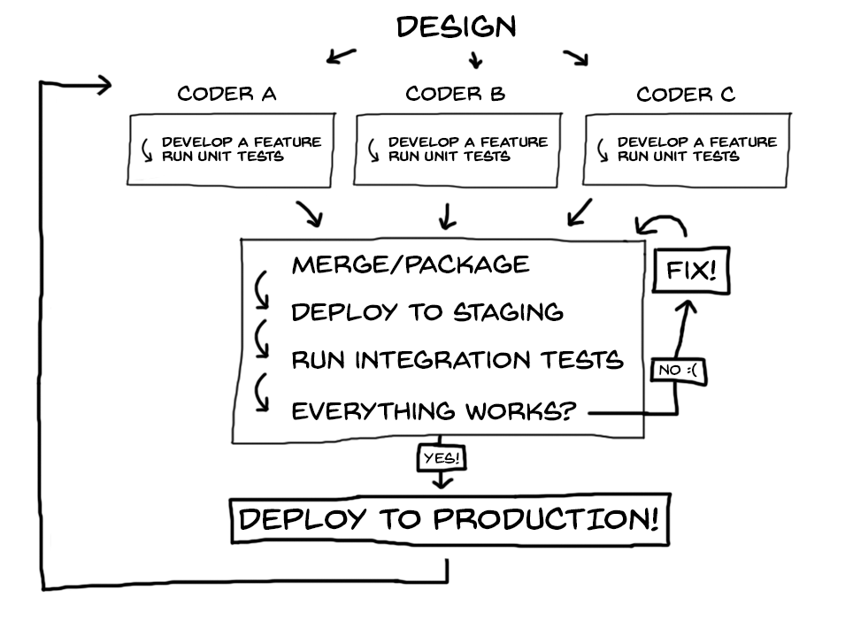

# The DevOps Story 

> Objective is to give students an overview of DevOps and Cloud and some of the leading technologies involved

> Put the students into groups, move the desks around so they are working in clusters

> Use a whiteboard liberally!

## Waterfall & Agile

Imagine you just started as a senior engineer for Twitazon 6 months ago and are now in charge of a department of 10 people, responsible for the delivery of the core application.

You've been called into your boss's office for a dressing down. The team has failed to release a single new feature in the 6 months that you've been in charge and **your job is on the line**. You have 2 months to turn it around otherwise you're fired.

Until now, your team have been using a waterfall methodology in their work and it hasn't been working very well. Gathering requirements, spending months writing code, testing it and then getting it approved has resulted in zero new features for your boss. 

These days, a company like Amazon will deploy new code several times every minute. Imagine trying to get that done with our step-by-step waterfall workflow! It's just impossible. 

You think to yourself: *"I know there are better ways to do this. We've been using waterfall for our Software Development Lifecycle. I know that Agile is a thing and Scrum and the Cloud are a things too."*  


### Student group task 
  
  ```
  Prepare a short presentation to explain what the Agile SDLC is and why it's essential these days. One group will be chosen at random to present their findings.
  ```


## What is DevOps?

> Optional listening: https://www.redhat.com/en/command-line-heroes/season-1/devops-tear-down-that-wall

Luckily, you found a comprehensive presentation on Agile and the SDLC. Understood. Agile puts a premium on **constant iterative improvements**. But now, you're wondering how you can help your developers actually do this. 

Currently, You have a developer team and an operations team. The developers write the code and the operations team manage the release of that code as well as managing the in-house servers.

Your team have two opposing goals. The developers want to make changes and the operations team want to minimise changes.

You see a big wall. The wall stretches as far as you can see to the right and all the way off to the left. It's taller than everyone, and there are people on both sides. But are they friends or enemies?

Developers create their code and throw it over the wall to operations, and then it's operations' problem. Not good.

So you jump on Google and after a while discover something called **DevOps** which apparently goes hand in hand with Agile. But it's full of jargon! You need to understand it all and find a starting point. 

You sketch out a process that you think makes sense based on your research so far:

> Draw on board



<cite>Image from www.logrocket.com</cite>

### Student group task

> Resource of DevOps/Agile relationship: https://cloudacademy.com/blog/devops-agile-relationship/

```
You need to research and find out the following:
  - What is DevOps?
  - How are DevOps and Agile related to each other?
  - What are CI and CD?
  - What is a pipeline?

  One group will be chosen at random to present their findings.
```

## Quiz Part 1

https://docs.google.com/forms/d/e/1FAIpQLSfEzIF62DImjd5HgLI7_2pGpduoH-KToafxvYlrKH-71ZXCFg/viewform


## Making Technology Choices

All right. Now you're excited. You can see a way forward now. You've taken this strategy back to your team leads and now you have to make a choice as to what technologies you're going to use.

From your research you've found that the group of tools you need is referred to as a "DevOps Toolchain".

We can break CI/CD software into two categories:

1. Installable software: Apps or services you can install on your computer or some remote machine (e.g., Jenkins, TeamCity)

2. SaaS: Apps or services with a web interface provided by an external company (e.g., CircleCI, Azure DevOps)

You've managed to narrow it down from the massive lists of tools you found and further research is needed on the following:

- Jenkins
- CircleCI
- Ansible
- Vagrant
- GitHub
- Sentry

### Student group task

```
Research the tools on the shortlist and find out what they are used for. One group will be chosen at random to present their findings.
```


## The Cloud, Containers & Deployment Environments

> Optional listening https://www.redhat.com/en/command-line-heroes/season-1/the-containers-derby

Now you're feeling much more confident. But that old server rack that sits in the basement? That's got to go. You're fairly sure that this is where the Cloud comes in. 

If all this is going to work, we need to get rid of our in-house servers and move our code onto the cloud. But what's the benefits of doing this? How do I justify the cost to my boss? And which one should I choose?

You've also come across the phrase 'containers' a few times now. You've also heard about 'deployment' environments. So you set out again to research some more.

### Student group task

Research the following:

- What are the benefits of cloud hosting?
- What are the top 3 cloud providers?
- What are the 4 development environments we need?
- What is Docker?
- What is Kubernetes?
- What is Amazon S3?
- What is a bucket?
- What is Amazon EC2?


## Recap

OK, so let's recap what we've found out:

- DevOps is an essential part of working in an Agile way. If we can't develop and release well tested code quickly then it makes implementing an Agile SDLC very difficult.

- DevOps is a set of practices that is intended to reduce the time between committing a change  and that change going into production while ensuring quality

- DevOps toolchains allow developers to do Continuous Integration and Continuous Deployment 

- A pipeline is a set of automated processes. E.G. When a developer tries to push their code to the common codebase, then a set of unit tests need to pass

- We can break CI/CD software into two categories:
  1. Installable software: Apps or services you can install on your computer or some remote machine (e.g., Jenkins, TeamCity)
  2. SaaS: Apps or services with a web interface provided by an external company (e.g., CircleCI, Azure DevOps)

- We know that we should probably choose between AWS, Azure or Google Cloud for hosting our code

- We'll probably need 3 or 4 environments;
  1. Development
  2. Testing
  3. Staging
  4. Production


 ## Quiz Part 2

 https://docs.google.com/forms/d/e/1FAIpQLSfLzaY-PPoiY9739Nr0Is9kGj0VzcjS2V3Tm_5VEZ0bCori9Q/viewform 
